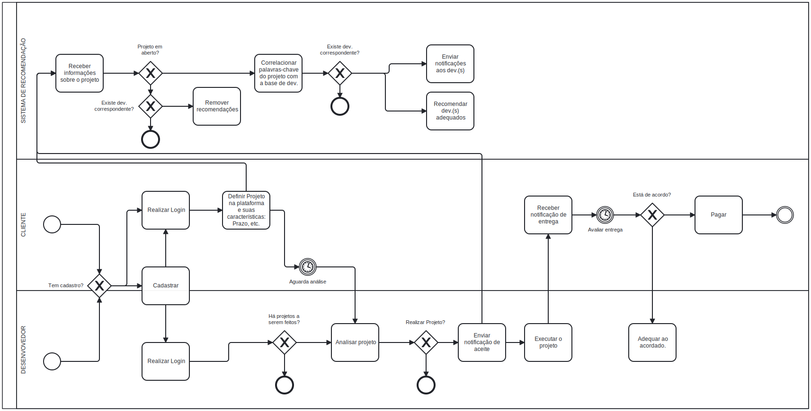

# FreelaIF

## Visão Geral

**FreelaIF** é uma plataforma de freelance criada para conectar estudantes do Instituto Federal a clientes da cidade e região, oferecendo oportunidades reais de trabalho, geração de renda e experiência profissional. A iniciativa visa também fortalecer o empreendedorismo estudantil e aproximar o ambiente acadêmico do mercado local.

## Objetivos

O projeto tem como principais objetivos:

- Proporcionar aos estudantes a divulgação de suas habilidades e a realização de serviços freelance.
- Permitir que empresas e pessoas físicas encontrem mão de obra qualificada e acessível.
- Incentivar a integração da comunidade acadêmica com o mercado regional.

Além disso, a plataforma contará com recursos de:

- **Recomendações inteligentes** de serviços para freelancers, baseadas em palavras-chave extraídas dos perfis e habilidades cadastradas.
- **Sugestões automáticas** de freelancers mais adequados para clientes, de acordo com os requisitos dos projetos.
  
  ## Como rodar os serviços usando Docker Hub

docker network create microservices-network
docker run --rm -d --name postgres-db-users-api --network microservices-network -e POSTGRES_USER=login -e POSTGRES_PASSWORD=login -e POSTGRES_DB=login_db postgres:15
docker run --rm -d --platform linux/amd64 --name eureka-server --network microservices-network -p 8761:8761 geessyca/eureka-server

Siga os passos abaixo para baixar as imagens e iniciar os containers dos serviços:

### 1. Baixe as imagens dos serviços
```bash
docker pull geessyca/eureka-server
docker pull geessyca/config-server
docker pull geessyca/spring-projects-api
docker pull geessyca/users-api
```

### 2. Crie a rede Docker para os microserviços
```bash
docker network create microservices-network
```

### 3. Inicie os bancos de dados
```bash
docker run --rm -d \
  --name postgres-db-users-api \
  --network microservices-network \
  -e POSTGRES_USER=login \
  -e POSTGRES_PASSWORD=login \
  -e POSTGRES_DB=login_db \
  postgres:15

docker run --rm -d \
  --name mongodb-projects \
  --network microservices-network \
  -p 27017:27017 \
  -e MONGO_INITDB_DATABASE=freelaif_db \
  -e MONGO_INITDB_ROOT_USERNAME=freelaif \
  -e MONGO_INITDB_ROOT_PASSWORD=freelaif \
  mongo:7.0
```

### 4. Inicie os serviços
```bash
docker run --rm -d --platform linux/amd64 \
  --name eureka-server \
  --network microservices-network \
  -p 8761:8761 \
  geessyca/eureka-server

docker run --rm -d --platform linux/amd64 \
  --name config-server \
  --network microservices-network \
  -p 8086:8086 \
  -e EUREKA_SERVER=http://eureka-server:8761/eureka \
  geessyca/config-server

docker run --rm -d --platform linux/amd64 \
  --name spring-projects-api \
  --network microservices-network \
  -p 8101:8101 \
  -e EUREKA_SERVER=http://eureka-server:8761/eureka \
  -e CONFIG_SERVER=http://config-server:8086 \
  geessyca/spring-projects-api

docker run --rm -d --platform linux/amd64 \
  --name users-api \
  --network microservices-network \
  -p 8080:8080 \
  -e EUREKA_SERVER=http://eureka-server:8761/eureka \
  -e CONFIG_SERVER=http://config-server:8086 \
  geessyca/users-api
```

Esses comandos irão baixar as imagens necessárias e iniciar todos os serviços em containers conectados à mesma rede Docker.

## Funcionamento

1. **Cadastro**: Estudantes e clientes realizam seu registro e criam perfis personalizados.
2. **Publicação de Projetos**: Clientes anunciam tarefas, especificando prazos e valores.
3. **Candidatura**: Estudantes se candidatam às oportunidades disponíveis.
4. **Seleção e Execução**: Clientes escolhem o freelancer ideal para o projeto, que é então executado conforme as especificações.
5. **Entrega e Validação**: Após a entrega do serviço, o cliente valida o trabalho.
6. **Pagamento**: O pagamento é liberado ao freelancer, com uma taxa de intermediação retida pela plataforma.

## Funcionalidades Principais

- Cadastro e autenticação de estudantes e clientes.
- Publicação, edição e acompanhamento de tarefas/projetos.
- Candidatura a tarefas por parte dos estudantes.
- Sistema de notificações em tempo real para atualizações de status e mensagens.
- Avaliação de freelancers após a conclusão dos projetos.
- Gestão de pagamentos integrados, com retenção automática da comissão da plataforma.
- Painéis personalizados para estudantes, clientes e administradores.
- Recomendações automatizadas de freelancers e projetos baseadas em palavras-chave.

## Monetização

O FreelaIF será sustentado pela retenção de uma porcentagem sobre o valor de cada serviço concluído, garantindo a operação e expansão contínua da plataforma.

## Modelo de processos:

Usaremos Scrum associado a inteligência artificial para otimização de tempo.
Segregando as etapas do fluxo em pequenos serviços de entrega contínua.

## Público-Alvo


## Requisitos do Sistema

### Funcionais

| ID | Descrição |
|----|-----------|
| RF01 | Cadastro e autenticação de estudantes e clientes. |
| RF02 | Publicação e gestão de projetos. |
| RF03 | Sistema de candidaturas para freelancers. |
| RF04 | Processo de seleção e contratação por parte do cliente. |
| RF05 | Controle de status de execução dos projetos. |
| RF06 | Envio de notificações de atualizações relevantes. |
| RF07 | Integração de pagamento e retenção de comissão. |
| RF08 | Sistema de avaliação de freelancers. |
| RF09 | Painel administrativo para gestão da plataforma. |
| RF10 | Recomendações de freelances/projetos baseado em palavras-chave. |

### Não Funcionais

| ID | Descrição |
|----|-----------|
| RNF01 | Responsividade para dispositivos móveis. |
| RNF02 | Autenticação segura utilizando JWT e OAuth2. |
| RNF03 | Notificações em tempo real utilizando MQTT. |
| RNF04 | Tempo de resposta inferior a 2 segundos por operação. |
| RNF05 | Alta disponibilidade do sistema (>99% de uptime). |
| RNF06 | Criptografia de dados sensíveis. |

## Restrições

- A plataforma será disponibilizada inicialmente apenas para estudantes do Instituto Federal local.
- O sistema deverá ter suporte prioritário a navegadores modernos (Google Chrome, Mozilla Firefox, Microsoft Edge).
- Integração de pagamento será feita utilizando soluções consolidadas no mercado, como MercadoPago ou API Pix.

## Roadmap Futuro

- Desenvolvimento de um aplicativo móvel para Android e iOS.
- Expansão para atender estudantes de outras instituições.
- Implementação de sistema de análise automatizada da qualidade dos projetos antes da entrega final.
- Melhoria contínua dos algoritmos de recomendação.

## Modelagem



### Cliente
1. **Cadastro/Login**:  
   O cliente inicia verificando se já possui cadastro na plataforma.
   - **Caso não tenha**, realiza o cadastro.
   - **Caso já tenha**, faz o login.
2. **Definição do Projeto**:  
   Após o login, o cliente define o projeto e suas características.
3. **Análise pelo Sistema de Recomendação**:  
   O sistema analisa o projeto para sugerir desenvolvedores adequados.
4. **Análise pelos Desenvolvedores**:  
   O projeto entra em estado de análise e é disponibilizado para todos os desenvolvedores cadastrados.
5. **Finalização do Projeto**:  
   Quando o projeto é finalizado, o cliente recebe uma notificação de entrega.
6. **Avaliação da Entrega**:  
   O cliente avalia a entrega:
   - **Se estiver de acordo**: Realiza o pagamento e o processo é encerrado.
   - **Se não estiver de acordo**: O projeto é ajustado conforme o acordado e retorna para nova entrega.
     
### Desenvolvedor
1. **Cadastro/Login**:  
   O desenvolvedor verifica se possui cadastro:
   - **Caso não tenha**, realiza o cadastro e depois faz login.
   - **Caso já tenha**, faz o login diretamente.
2. **Verificação de Projetos**:  
   O desenvolvedor verifica se há projetos disponíveis para serem feitos.
3. **Análise de Projetos**:  
   - O desenvolvedor pode ver os projetos disponíveis para análise.
   - Também pode visualizar os projetos para os quais foi recomendado.
4. **Aceitação do Projeto**:  
   O desenvolvedor decide se deseja realizar o projeto.
   - **Caso não deseje**: O fluxo termina.
   - **Caso aceite**: Envia uma notificação de aceite e executa o projeto, aguardando a avaliação do cliente.
   
### Sistema de Recomendação
1. **Recepção de Informações**:  
   O sistema recebe informações sobre o projeto.
2. **Verificação de Disponibilidade do Projeto**:  
   O sistema verifica se o projeto está em aberto.
   - **Caso não esteja**: As recomendações são removidas.
   - **Caso esteja**: O sistema correlaciona as palavras-chave do projeto com a base de desenvolvedores.
3. **Verificação de Desenvolvedores**:  
   O sistema verifica se há desenvolvedores que correspondem às necessidades do projeto.
   - **Caso não haja**: O processo é encerrado.
   - **Caso haja**: O sistema envia notificações aos desenvolvedores recomendados e exibe os desenvolvedores recomendados para o cliente.
---
## Contribuidores
- [Gessyca Moreira](https://github.com/Geessyca)
- [Marcus Vinicius](https://github.com/PyMarcus)
